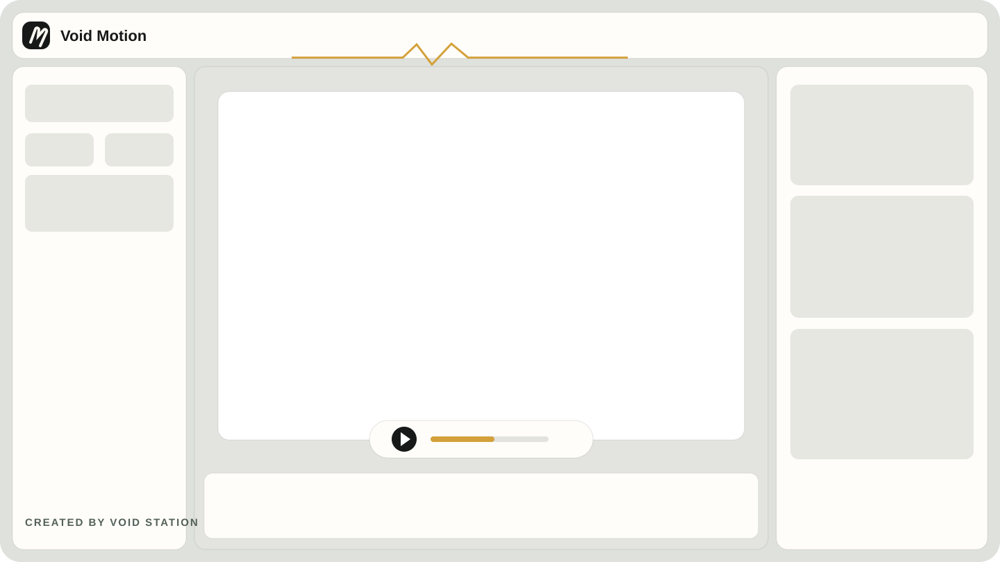

# Void Motion

<p align="center">
  <strong>Turn still images and text into hand-drawn whiteboard animation.</strong><br />
  A browser-native animation workbench created by <strong>Void Station</strong>.
</p>

<p align="center">
  <a href="https://void-motion.vercel.app">Live app</a> ·
  <a href="https://void-motion.vercel.app/tutorial">Tutorial</a> ·
  <a href="https://github.com/voidstation-dev/void-motion/issues">Support</a>
</p>



## What is Void Motion?

Void Motion is a privacy-first whiteboard animation editor that runs directly in the browser. Add images or text, arrange layers on the canvas, choose a drawing behavior, preview the hand-drawn sequence, and export the result as video.

Projects remain in the browser through IndexedDB. The editor does not require an account or upload project media to an application server.

## Highlights

- Image and text layers with ordering, visibility, grouping, transforms, crop, and slice tools.
- On-canvas text creation and editing with cursive fonts, inline scaling, and real-time preview.
- Scanner, contour, outline chunks, chunk jump, subject-aware, and drawing animation styles.
- Hand styles, independent reveal/hand speeds, canvas backgrounds, aspect ratios, and resolutions.
- Local project persistence with rename, autosave, undo, and redo.
- Browser-side WebM and supported MP4 export.
- Responsive React interface with Vietnamese and English localization.
- Migrated React tutorial, about, and privacy pages.

## Keyboard Shortcuts & Canvas Interactions

| Action | Shortcut / Gesture | Description |
| --- | --- | --- |
| **Add / Edit Text** | `Double-click Canvas` | Opens the on-canvas dashed editor at the clicked point with font styling preview |
| **Commit Text** | `Enter` / `Ctrl+Enter` / `✓ Done` | Commits and creates or updates the text layer |
| **Cancel Text** | `Escape` / `✕ Cancel` | Cancels text placement or editing without saving |
| **Delete Selected Layer** | `Delete` or `Backspace` | Deletes the currently selected layer from canvas & history |
| **Undo** | `Ctrl+Z` / `Cmd+Z` | Undoes the last action (guarded while playing) |
| **Redo** | `Ctrl+Y` / `Ctrl+Shift+Z` / `Cmd+Shift+Z` | Redoes the previously undone action |
| **Play / Pause** | `Space` | Toggles animation playback |
| **Select / Move / Resize** | `Single-click` / `Drag handle` | Selects layer, drags layer position, or resizes from 8 handles |

## Quick start

Requirements: Node.js 22+ and pnpm 10+.

```bash
git clone https://github.com/voidstation-dev/void-motion.git
cd void-motion
corepack enable
pnpm install --frozen-lockfile
pnpm dev
```

Open `http://localhost:5174`.

## Commands

| Command | Purpose |
| --- | --- |
| `pnpm dev` | Start the Vite development server |
| `pnpm typecheck` | Validate TypeScript |
| `pnpm lint` | Run ESLint |
| `pnpm format` | Check formatting |
| `pnpm i18n:check` | Check locale namespace/key parity |
| `pnpm test` | Run Vitest unit and UI tests |
| `pnpm test:e2e` | Run Playwright browser smoke tests |
| `pnpm build` | Create the self-contained production artifact |
| `pnpm preview` | Serve the production artifact locally |
| `pnpm run ci` | Run the complete CI quality gate |

## Architecture

```text
React UI + i18next + Zustand
           │
           ▼
Typed services and adapters
           │
           ▼
Canvas renderer + isolated legacy animation runtime
           │
           ▼
IndexedDB projects + browser-native video export
```

React owns every visible surface. The preserved animation runtime is hosted in an isolated same-origin frame while its behavior is incrementally migrated behind typed services. Production builds copy the required runtime assets into `dist/legacy` so the deployed artifact is self-contained.

More migration detail is available in [`docs/migration`](./docs/migration).

## Quality and releases

Every pull request and main-branch push runs:

1. locked dependency installation;
2. i18n parity, TypeScript, ESLint, and Prettier checks;
3. the complete Vitest suite;
4. a production build and artifact integrity check;
5. Chromium smoke tests against the built application.

Vercel releases use a prebuilt Preview artifact. Production promotion happens only after the Preview smoke check passes. See [`docs/release/PRODUCTION_RELEASE_PLAN.md`](./docs/release/PRODUCTION_RELEASE_PLAN.md).

## Deployment

The repository includes `vercel.json` and GitHub Actions workflows for deterministic Vercel deployment. Configure these repository secrets before enabling automated deploys:

- `VERCEL_TOKEN`
- `VERCEL_ORG_ID`
- `VERCEL_PROJECT_ID`

Create `VERCEL_TOKEN` from the Vercel Dashboard with an explicit expiry and project/team scope. The production workflow is intentionally manual and can be protected with GitHub's `production` environment approvals. Do not commit tokens or `.vercel/` project metadata.

## Privacy

Void Motion stores editor projects locally in the browser. Export processing happens on the user's device. Review the current policy on the [live privacy page](https://void-motion.vercel.app/privacy) or in [`PRIVACY.md`](./PRIVACY.md).

## Contributing and support

- Report bugs or request features in [GitHub Issues](https://github.com/voidstation-dev/void-motion/issues).
- Keep pull requests focused and include tests for behavior changes.
- Run `pnpm run ci` before opening a pull request.

## Credits

Void Motion is created and maintained by **Void Station**. It modernizes the open-source Inkplainer foundation while preserving its animation behavior and evolving the product into a typed React application.

## License

Licensed under the terms in [`LICENSE`](./LICENSE).
